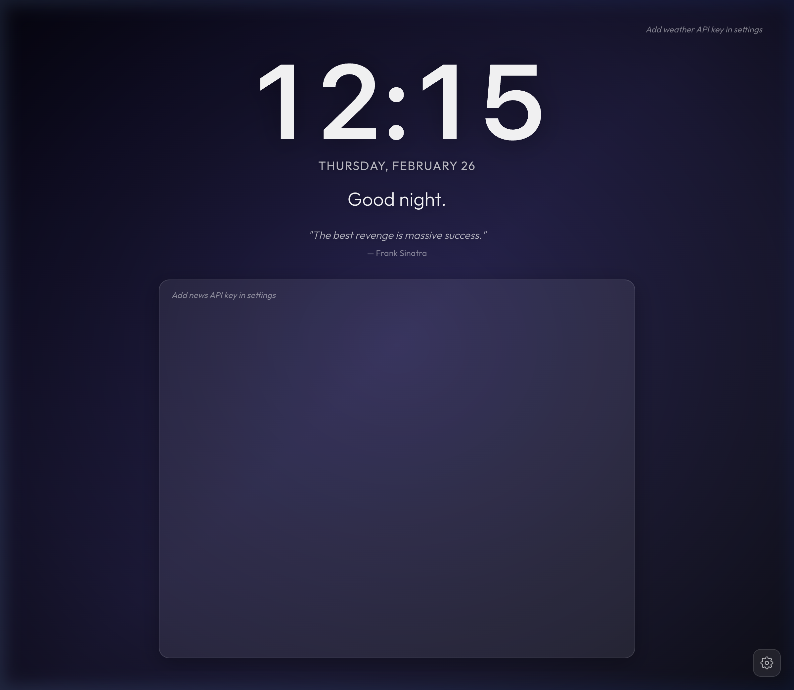

# Cool New Tab ✨

A beautiful, minimalist Chrome extension that replaces your new tab page with a dynamic dashboard featuring live backgrounds, weather, world clock, news, quotes, and Google Calendar integration.



## Features

- 🖼️ **Dynamic Backgrounds** — Stunning photos from Unsplash, auto-refreshing on your schedule
- 🕐 **Clock & Greeting** — 12-hour format with personalized greetings based on time of day
- 🌤️ **Weather** — Auto-detects your location or add cities manually (click to toggle °F/°C)
- 🌍 **World Clock** — Track multiple timezones with AM/PM indicators
- 📰 **News Feed** — Top headlines from GNews, localized to your country
- 💬 **Daily Quotes** — Curated inspirational quotes that rotate daily
- 📅 **Google Calendar** — Compact view of upcoming events in the top-right corner
- ⚙️ **Customizable** — Configure everything through a clean settings panel

## Installation

1. Clone or download this repository
2. Open `chrome://extensions` in Chrome
3. Enable **Developer Mode** (top-right toggle)
4. Click **Load unpacked** and select the `cool-new-tab` folder
5. Open a new tab — you're all set!

## Setup

Click the ⚙️ gear icon (bottom-right) to open Settings, then configure:

### API Keys

| Service | Get Key | Free Tier |
|---------|---------|-----------|
| [Unsplash](https://unsplash.com/developers) | Create an app → Access Key | 50 req/hour |
| [OpenWeatherMap](https://openweathermap.org/api) | Sign up → API Keys | 1,000 calls/day |
| [GNews](https://gnews.io/) | Sign up → Dashboard | 100 req/day |

### Google Calendar (Optional)

1. Create a project in [Google Cloud Console](https://console.cloud.google.com/)
2. Enable the **Google Calendar API**
3. Create an OAuth 2.0 Client ID (Chrome Extension type)
4. Add your Client ID to `manifest.json` → `oauth2.client_id`
5. In Settings, click **Connect Google Calendar**

### Weather

- Click **Use My Location** to auto-detect your city
- Or manually type city names like `Seattle, WA` or `London, UK`
- Click the weather widget to toggle between °F and °C

## Project Structure

```
cool-new-tab/
├── manifest.json        # Chrome extension manifest (MV3)
├── newtab.html          # Main page
├── service-worker.js    # Background service worker
├── css/
│   └── styles.css       # All styles (glassmorphism, animations, layout)
├── js/
│   ├── app.js           # App initializer
│   ├── storage.js       # Chrome storage wrapper with localStorage fallback
│   ├── background.js    # Unsplash background fetcher with caching
│   ├── clock.js         # 12-hour clock & greeting
│   ├── weather.js       # Weather with geocoding & geolocation caching
│   ├── worldclock.js    # Multi-timezone clocks
│   ├── quotes.js        # Daily quote rotation
│   ├── news.js          # GNews headlines with country filtering
│   ├── calendar.js      # Google Calendar integration
│   └── settings.js      # Settings panel UI & persistence
└── icons/               # Extension icons (16, 48, 128px)
```

## Tech Stack

- **Vanilla JS** — No frameworks, no build step
- **Chrome Extension Manifest V3**
- **Google Fonts** — Inter & Outfit
- **APIs** — Unsplash, OpenWeatherMap, GNews, Google Calendar

## License

MIT
